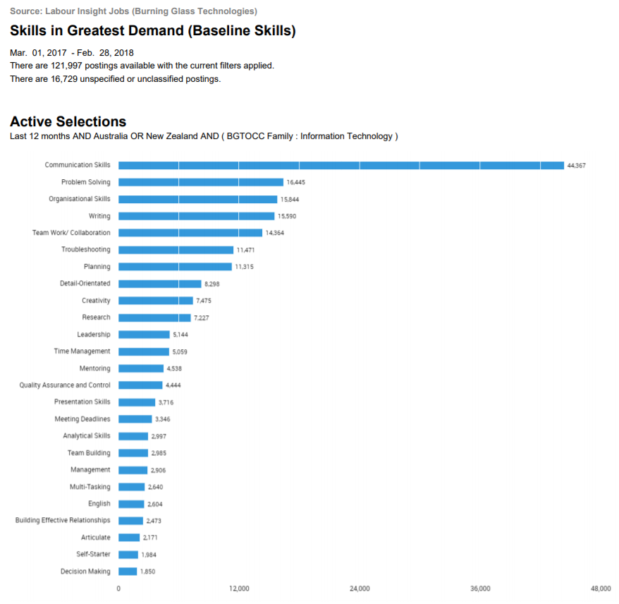
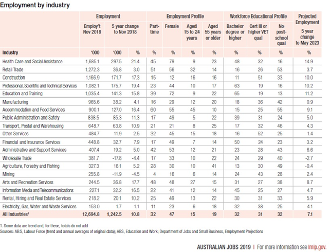
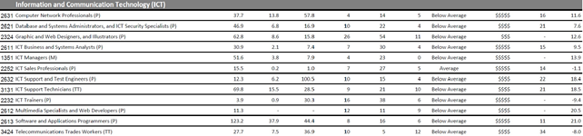
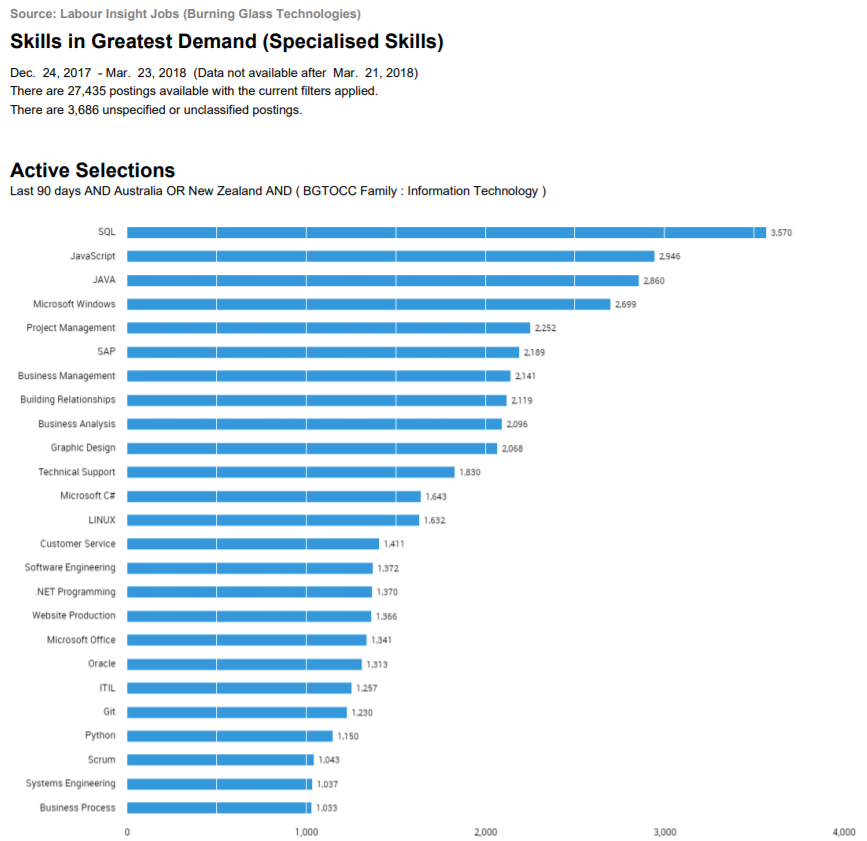

# 
 Burning Glass Data 

### 
 Individual Bios: 

#### Samuel Jones 

The preferred job is for a software developer / engineer with sufficient knowledge on coding languages such as: C#, Python and JavaScript. The required / desired database language is PHP, ASP.net, SQL coding, and the role requires a Bachelor of Science or similar. The required traits for the potential employment include: Excellent Communication skills, Presentation skills, problem solving and analytical skills and a team player. Samuel currently has experience and some exposure to Python and Javascript.

#### Jacob Smith 

 The preferred job is for a Business Information Systems Analyst and the preferred knowledge is on Microsoft Office, CRM, Microsoft Power platform like Dynamics 365, Lean Six Sigma, Virtualisation and database analyst including update. A minimum of Bachelor’s Degree is essential in the relevant areas and traits preferred for potential employment include: Problem Solving skills, analytical, ability to multitask, meeting deadlines and being able to prioritise. Jacob has an interest in IT and have always had great ideas on the application he wants to make. His skills include building a robust website and has some knowledge on information systems and coding.

#### Scott Smith

The ideal role for Scott is in the field of IT Management, Project leader and the preferred skills and knowledge include IT troubleshooting, ICT systems, Customer Excellence in maintaining systems, Windows SOE, Application Packaging in service and patching. The traits needed for the role include: Analytical skills, able to work under pressure, manage staff and organising skills. Scott’s past experience includes working for the Army before entering the IT sector. Scott has a wealth of knowledge and skills in the IT sector and currently employed in the IT field. Scott has undertaken further studies to broaden and deepen his IT Systems skills and eventually want to migrate to the field of Applications Packaging and testing stages of packages.

#### Kim Ve Jong

The ideal role for Kim is in the field of Policy for the Public sector. The skills needed for Policy is the understanding of Policy cycle, current legislation, departmental budget, Microsoft packages, understand the criteria and objective, prepare report for presentation and formulate advice. The traits needed for the policy role include analytical skills, problem solving, research, knowledge on current policy and legislation including law, being able to work under pressure and meeting scheduled deadlines. With Kim Ve’s current studies in the relevant field for Public Service, the degree has positioned Kim to pursue the role of Policy worker.  
David Mulgrue – The ideal role for David is in the field of a Software Engineer specialising in iOS systems. It is a developer role for mobile devices by building reusable code and library for later use. The role also required collaborating with the backend team to integrate apps and API’s. The knowledge includes C, Apple tools, Android and Windows coding. The trait the for the suitable candidate includes presentation, analytical skills and problem solving skills.

### 
Ideal Jobs - Group's Core Skill Requirements

Based on our group’s desired career choice and our ideal paths that we all want to forge, we have identified our group’s core requirement:  

- Communication
- Problem Solving Skills
- Analytical Skils
- Time Management

We all need to possess these core skills and do really well to succeed in our chosen career path, as these skills will be assessed, analysed, being judged upon, and form the basis of an impression. These four skills when forming a team for collaboration is a definite must, as failing to do so will ultimately break down, nothing gets done and over budget to cover these shortfalls. The team will also get disgruntled, for example, the group or a member of the group has poor time management skills and ultimately the project has not been completed by the scheduled time, and well, leave it to the (ether, it will sort itself out (the marker will sort it out!!)). Contrary to this notion, if the group embraces these four core skills, it is a recipe for success.   

However, each of our group members also has a unique subset skill that is suitable and curated for their role more specifically. They are:

- <b>Presentation Skills</b>

Samuel Jones – A unique set of subset skills required for the ideal job. This is very important because presentation in terms of powerpoint slides, dress code and grooming will set an impression, including an impression of the work. Even the way Samuel codes will need to have a proper structured coding that makes much more readable and not look like spaghetti style coding. So presentation skills for Samuel is a must.

- <b>Multi-Tasking</b>

Jacob Smith – The role of Information systems analyst may need to wear a different hat here and there, by the project being analysed. There may be multiple projects happening at the same time and applying efficiency by using a suite of applications for tracking, analysing, estimate, costing, resources and much more indeed does require multitasking and delegation. An example of  requiring the knowledge of lean six sigma is a testament to the importance of multitasking.

- <b>Leadership</b>

Scott Smith – The ideal role of IT Management / Leadership is leadership skills to guide and mentor staff to meet the objective requirements set by the organisation. Scott may need to wear different hats everyday, such as mentoring staff, sensitive conversation, meeting with upper management or a meeting with the group. As management, Scott also needs to possess customer excellence to retain external stakeholders, customers and clients to ensure the well being of the organisation.

- <b>Research</b>

Kim Ve Jong – As an ideal work in the policy in the public sector, research is paramount  to understand and articulate the formulation of policy or an update to policy change. There are so many components that make up policy, such as legislation, law from each states, political climate, data, and knowledge is an essential component. However, research skills play a crucial role in policy because it ensures that policy drafted is well refined and has been researched thoroughly covering aspects that is meant to be covered. 
Below are the core skills requirement from Burning Glass data encapsulating our group’s core skills and our unique subset skill in demand of the industries.

  

****

### 
Core Skills Breakdown 

Below are the core skills requirement from Burning Glass data encapsulating our group’s core skills and our unique subset skill in demand of the industries.

When delving further to analyse the composition of the labour market in terms of industry types, IT is well suited in many sectors of the Australian industry, as each sector will depend on their IT systems to run their core business. With Kim Ve’s policy style of work however, it may well be suited for most industries, as policy ACT govern and regulate industries by setting the parameters on how they should operate. Below is a graph that shows the major industries in Australia by the  Department of Jobs and Small Business:  

   

Furthermore, the top job types in Australia data collected from the Department of Jobs and Small Business reveal the core role and positions filled in the Industry. For example the position of software and applications developer has around 123 thousand employed in that field and the ANZSCO code is 2613. Below are the graph for the team’s desired role encapsulated in the occupation matrix from the Department of Jobs and Small Business: 

  

### 
Highest Ranked Skills not in Group

Based on the data provided on Burning glass data, the three highest skills not listed in our group is organisational skills, writing and planning. However, the core skill requirements that our group has identified would be able to cover these areas adequately and with an additional member being David joining our team recently, we have expanded our capabilities and resource sharing.
  

  

From the list of IT skills in highest demand and not in our groups list are Graphic Design, SAP and Javascript. Although Kim Ve’s preferred policy role has very little to with specific IT software and hardware platform, it means these skills will be covered by the other team members and minimising this capability gap. 

### 
Opinions on Burning Glass Data

Our group opinion has not changed with the Burning Glass data as we are entrenched in our chosen field and will pursue that path. The length to assess has been too short, only two weeks to form an opinion, so there will be no changes. However, if the same question was asked a year or more later, then there is a chance that opinion will change, and with new Burning glass data to support that change in opinion if needed. 

***

