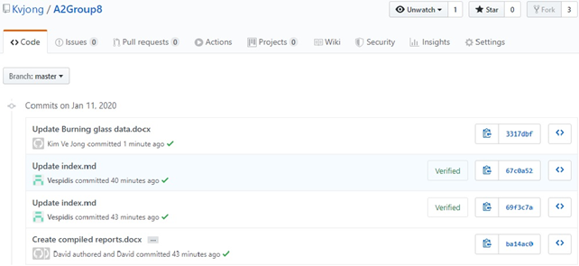
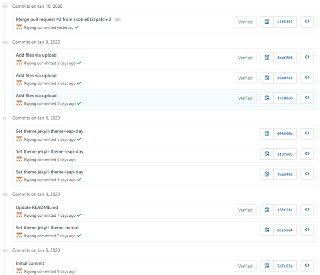
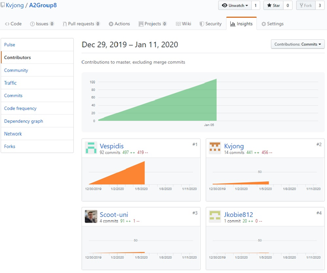
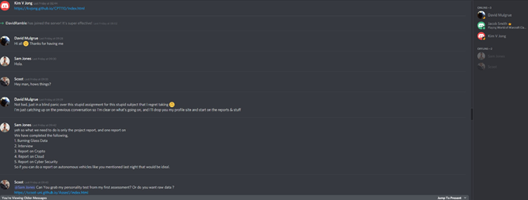

# 
Group Reflection

### Kim Ve Jong
>Since forming our team over a month ago in early December, we have had collaboration ever since using the Discord software. The group has been really supportive and we have delegated our work appropriately with each member contributing each section of work. My responsibilities include creating the Github repository and regulate the repository, and the report on Industry Data with Burning Glass. I have worked with everybody’s bio from assignment 1 and incorporated into our assignment 2’s bio. Now, some of the members in our group work full time and in my case, I work in the afternoon shift and sometimes cannot chat in the evening session. However, when I got home around 2am, I quickly attend the task the group has set out earlier and they usually respond in the morning. The team also adjusted and included collaborating during the morning as well. So, by around Christmas we had an active channel and typed regularly throughout the day to get the latest update including the update on Github. With an additional member being David that recently joined our group, he has quickly settled in our group and took responsibility for his share of the work. Samuel Jones has played a crucial role in our group and has shown leadership amongst the group and have been quite active in updating the Github repository. Below is a snapshot in our updates on Github files and documents.
 

### David Mulgrue
>This group assessment has been fraught with difficulties which thankfully have all ended up being resolved at the last moment.
My first group seemed to be working well, but due to some miscommunication over the holiday period I ended up being removed from the group and placed in an auto assigned one. 
I made multiple attempts to make contact with the members of this group but was unsuccessful, in the end I managed to make contact with a group who had open space and could use an extra person to help with some reports and polish some of the documentation, which I was more than happy to do. 
I’ve found that while this group has had some relatively small communication problems, the quality of the work has been excellent and I have had no issues with slotting myself in and compiling the work and adding my own to make a complete and comprehensive set of reports.

### Scott Smith
>I have worked in many teams in my career, made up of people from various backgrounds and cultures. This is the first time that I have worked in a team of people that I haven’t met. As we are only a couple of days out from submission date, overall, I feel that our team has worked quite well together. We were off to a “shaky” start due to the Christmas period and most of us working different jobs, particularly those that work in a shift work environment.  

We initially tried to do voice discord chats, that didn’t work out well due to the aforementioned reasons. So, we ended up using Discord text chat which was a far better solution, people could reply when they had a chance. Once we had our communication sorted, tasks were assigned, and we were able to work within our own time for overall compilation later. We could have improved by communicating earlier.  

Once thing that was surprising (but not bad) we had a new member join our team only 6 days out from submission. The member was having problems communicating with his own team, so we felt we were in a position to help him. 
One thing about groups, every person has their own ‘pros and cons’ communication is key. You can’t rush things, everyone has their own busy schedule.

### Samuel Jones
>Everyone contributed fairly to the assignment, and it was smooth regarding that. Nobody avoided doing any work that they were asked to. However, we definitely should have been more organised leading into the New Year, despite the fact that it was a holiday period, leaving everything till the last minute put a lot of pressure when we were all returning back to work and had other subjects to work on as well. One of the more surprising aspects for me was looking at the groups varying jobs and realising just how diverse the industry was.  For me the biggest thing about group work is structure, everyone understanding their responsibility and having work be divided in a fair way, that also appeals to the strengths of each individual rather than lumping them with work they can’t do is vitally important.

### Jacob Smith
>In this group reflection we will be talking about a lot of things about the assignment and how well things went, If anything could be improved , something that was surprising, something that I learnt about groups, How well  you think your github log if activity reflects your group’s work on this assignment.
I think we did really well compiling data as a group. If anything could be improved it would be working on communication. The most surprising thing was how well all come up with ideas that contributes to the group.  Something that I learnt about groups is that some people don’t respond to messages and talk to you about the group assignments. Sam has 94 commits to the GitHub page, Kim has 15 commits to the GitHub page, scoot has 4 commits to the GitHub page, I have 2 commits to the github page. I think  this data is very accurate in compiling data. Overall I think everyone has put in 100% effort except for the 2 guys who wished not to participate, but all in all we did pretty well at compiling data and transferring it from whether its word doc or text document into the website.

## 
 GitHub Data & Discord 

